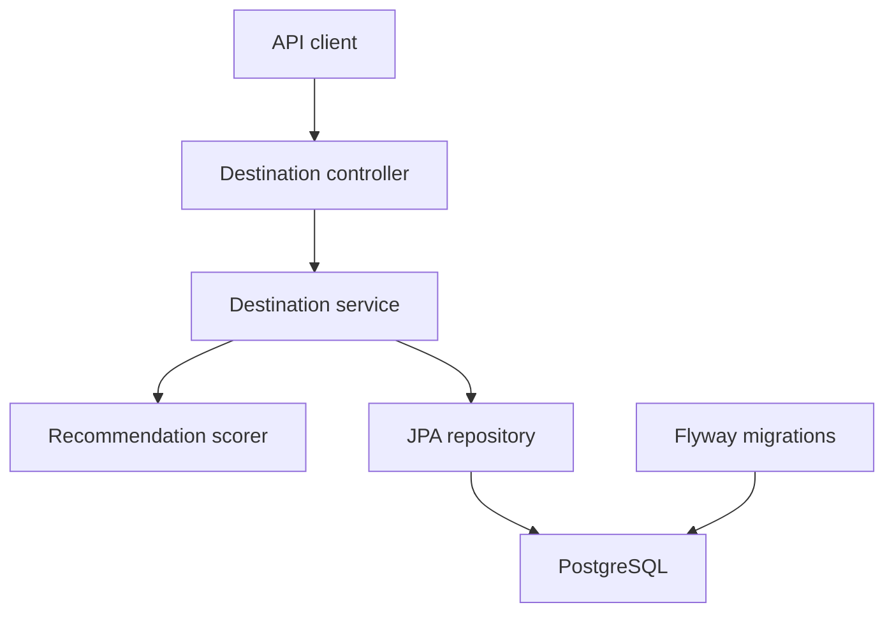

# TripMatch

[](https://github.com/wardy-t/tripmatch/actions/workflows/ci.yml)
[](https://github.com/wardy-t/tripmatch/actions/workflows/codeql.yml)

TripMatch is a travel destination recommendation API built with Kotlin,
Spring Boot and PostgreSQL.

It allows destinations to be created, managed and filtered, then ranks them
against a traveller's budget, preferred climate, interests and maximum flight
time.

## Technology

- Kotlin
- Java 21
- Spring Boot
- Spring Web MVC
- Spring Data JPA
- PostgreSQL
- Flyway
- Docker and Docker Compose
- Testcontainers
- JUnit 5
- JaCoCo
- Springdoc OpenAPI
- GitHub Actions
- CodeQL and Dependabot

## Features

- Create, retrieve, update and delete destinations
- Filter destinations by budget, climate and interest
- Paginated and sortable destination results
- Deterministic recommendation scoring
- Bean-validation request handling
- Structured API error responses
- PostgreSQL schema management with Flyway
- Interactive Swagger/OpenAPI documentation
- Containerised application and database
- Integration tests using disposable PostgreSQL containers
- Automated coverage enforcement and security analysis

## Recommendation scoring

TripMatch assigns each destination a score out of 100:

| Category | Maximum score |
|---|---:|
| Budget compatibility | 35 |
| Climate match | 25 |
| Shared interests | 30 |
| Flight-time compatibility | 10 |
| **Total** | **100** |

Results are ordered by total score, followed by cost and city name to provide
deterministic tie-breaking.

## Architecture



The application follows a layered structure:

- **Controller:** HTTP routing, request validation and responses
- **Service:** business logic and transaction boundaries
- **Recommendation:** isolated, testable scoring logic
- **Repository:** persistence and filtered queries
- **Flyway:** version-controlled database schema

## Architecture decisions

- [ADR 0001: Layered application architecture](docs/architecture/0001-layered-architecture.md)
- [ADR 0002: Deterministic recommendation scoring](docs/architecture/0002-deterministic-recommendation-scoring.md)
- [ADR 0003: Traffic management](docs/architecture/0003-traffic-management.md)

## Running with Docker

### Requirements

- Git
- Docker Desktop

Clone the repository:

```bash
git clone https://github.com/wardy-t/tripmatch.git
cd tripmatch
```

Create your local environment file:

```bash
cp .env.example .env
```

Start the complete application:

```bash
docker compose up --build -d
```

Check container health:

```bash
docker compose ps
curl http://localhost:8080/actuator/health
```

Stop the application:

```bash
docker compose down
```

Local database data is retained in the Docker volume unless the volume is
explicitly removed.

## API documentation

After starting the application:

- Swagger UI: http://localhost:8080/swagger-ui.html
- OpenAPI specification: http://localhost:8080/api-docs
- Health endpoint: http://localhost:8080/actuator/health

## Example request

Create a destination:

```bash
curl -i \
  -X POST http://localhost:8080/api/destinations \
  -H "Content-Type: application/json" \
  -d '{
    "city": "Barcelona",
    "country": "Spain",
    "averageCost": 720.00,
    "climate": "WARM",
    "flightTimeHours": 2.3,
    "interests": ["food", "architecture", "nightlife"]
  }'
```

Request recommendations:

```bash
curl \
  "http://localhost:8080/api/destinations/recommendations?budget=800&climate=WARM&maxFlightTimeHours=4&interests=food,architecture&limit=5"
```

## Running locally

### Requirements

- Java 21
- Docker Desktop

Start PostgreSQL:

```bash
docker compose up -d postgres
```

Load the local environment:

```bash
set -a
source .env
set +a
```

Run Spring Boot:

```bash
./gradlew bootRun
```

## Testing

The test suite includes:

- Unit tests for recommendation scoring
- Repository integration tests
- Controller integration tests
- PostgreSQL integration through Testcontainers
- OpenAPI availability checks

Run all verification tasks:

```bash
./gradlew clean check
```

Generate the JaCoCo report:

```bash
./gradlew clean test jacocoTestReport
open build/reports/jacoco/test/html/index.html
```

Current coverage gates:

- Line coverage: 90%
- Branch coverage: 60%

## Traffic and load testing

TripMatch caps destination pages at 100 records and applies a configurable
token-bucket limit to the recommendation endpoint.

Run the containerised traffic test:

```bash
docker compose up --build -d
docker compose restart app
docker compose --profile load-test run --rm k6
```

## CI/CD and repository automation

GitHub Actions automatically runs:

- Compilation and tests
- JaCoCo coverage verification
- Docker Compose smoke testing
- Health endpoint verification
- OpenAPI endpoint verification
- CodeQL Kotlin security analysis

Dependabot monitors:

- Gradle dependencies
- Docker base images
- GitHub Actions

## Database migrations

Flyway migrations are stored in:

```text
src/main/resources/db/migration
```

Hibernate validates the entities against the migrated schema rather than
creating or modifying production tables automatically.